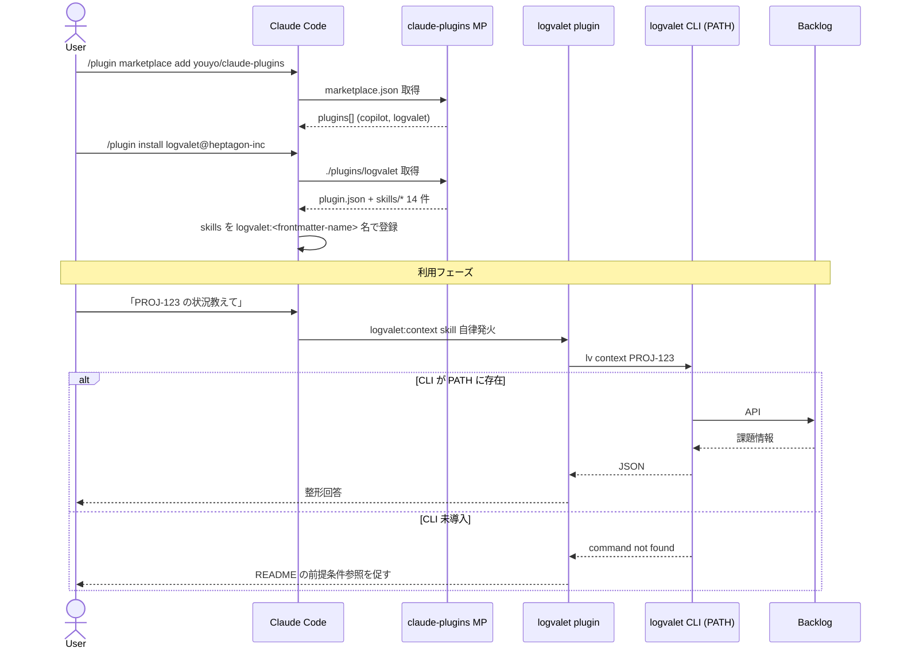

# 計画書: logvalet 集約 & skill name 表示統一（コロン区切り単一 namespace）

## 1. Context

`youyo/logvalet` リポジトリは現在、Go 製 CLI バイナリ・MCP サーバー実装・Claude Code skills を同居させている。本計画は **skills 部分のみ** を `youyo/claude-plugins` マーケットプレース配下 (`plugins/logvalet/`) に集約し、Claude Code の `/plugin install` 経由でユーザーが導入できる正規ルートを整える。

加えて、ユーザーから追加要望として **「logvalet と copilot の skill name namespace 表記を一貫させる（コロン区切りで統一）」** が出た。これは「`copilot:code-review`、`logvalet:context` のような綺麗な単一 namespace 表示にする」という意図と解釈する（後述の観測事実に基づく）。

### なぜ今やるか

1. **インストール体験の統一**: 既に `copilot` が `claude-plugins` にあり、ユーザーは 1 つのマーケットプレースから両方を入手したい。
2. **責務分離**: 元 `logvalet` リポジトリは Go バイナリ・MCP の実装に集中させ、配布物（skills）はマーケットプレース側で管理する。
3. **命名規則の一貫性**: 現状 `copilot:copilot-pr-review` のような二重 prefix 表示になっており、ユーザーが skill 名を予測しづらい。`copilot:pr-review` のような単一 namespace に揃える。
4. **メンテ単純化**: skills の更新サイクルとバイナリリリースサイクルが分離される。

### スコープ外（明示）

- Go ソースコード・`Dockerfile`・`.goreleaser.yaml`・`docs/specs/` — 元 logvalet リポジトリに残置
- MCP サーバー実装 — 同梱しない（CLI のみ前提）
- 元 logvalet リポジトリ側の `skills/` および `.claude-plugin/` 削除作業 — 別 PR としてフォローアップ
- CHANGELOG（claude-plugins 側に未整備、今回も対象外）

## 2. ユーザー確定事項（前提）

| # | 項目 | 確定内容 |
|---|---|---|
| 1 | 集約スコープ | スキルのみ移植 |
| 2 | MCP 同梱 | しない（CLI のみ） |
| 3 | 元リポジトリの位置づけ | CLI/MCP 専用として残す。skills 削除は別 PR |
| 4 | CLI バイナリ配布 | PATH 前提（ユーザーが `brew install` / `go install` で別途導入） |
| 5 | skill name 表示 | `<plugin>:<skill>` 単一 namespace に統一 |

## 3. Claude Code Plugin の namespace 規則（観測事実）

現在の Claude Code セッションの available skills 一覧には以下が登録されている:

```
copilot:copilot-pr-review
copilot:copilot-code-review
claude-mem:smart-explore
devflow:roadmap
```

各プラグインの SKILL.md frontmatter を実 grep した結果と照合すると、以下の規則が**観測事実**として確定する:

> **規則: 表示名 = `<plugin>:<frontmatter-name>`。システムは frontmatter `name` に対して盲目的に `<plugin>:` を前置する。プレフィックス検出は行わない。**

例:

| frontmatter | 所属プラグイン | 表示名 |
|---|---|---|
| `name: copilot-pr-review` | copilot | `copilot:copilot-pr-review`（二重 prefix） |
| `name: smart-explore` | claude-mem | `claude-mem:smart-explore`（クリーン） |
| `name: roadmap` | devflow | `devflow:roadmap`（クリーン） |

→ **クリーンな単一 namespace を得るには、frontmatter `name` を「素のスキル識別子」にする必要がある**（プラグイン名を含めない）。

## 4. 命名規則ルール（本計画で確定）

### 4.1 frontmatter `name` のフォーマット

```
name: <skill-identifier>
```

- プラグイン名は frontmatter に**書かない**（システムが自動付与）
- `<skill-identifier>` はスキル個別識別子。ハイフン繋ぎ (`code-review`) を識別子内部で許容
- コロン (`:`) は使用しない
- 表示時は自動で `<plugin>:<skill-identifier>` になる

### 4.2 ハブスキル（プラグイン名と同一）

`logvalet` プラグインのハブスキル（プラグイン全体の案内役）の frontmatter は `name: logvalet` を**例外的に維持**する（プラグイン名と同名）。

- 表示名は `logvalet:logvalet` となるが、ハブの慣例として許容
- 他スキルからの cross-reference は無いため影響軽微
- 将来 Annotation Cycle で `home` / `help` 等にリネーム要望があれば再検討（その場合 cross-reference は他スキルに無いので影響軽微）

### 4.3 cross-reference の整合性

ハブ `skills/logvalet/SKILL.md` 内には `/logvalet:<skill>` 形式の参照が **計 26 箇所**（重複参照含む実数、実体スキル数 13）存在する。本計画適用後の表示名と完全一致するため**書き換え不要**:

```
/logvalet:context  ←→  frontmatter name: context  →  表示 logvalet:context  ✓
/logvalet:my-week  ←→  frontmatter name: my-week  →  表示 logvalet:my-week  ✓
... (全 13 種一致)
```

## 5. 既調査済みの事実

### 5.1 取り込み先 (`claude-plugins`) の規約

- ディレクトリ構造: `plugins/<name>/.claude-plugin/plugin.json` + `plugins/<name>/skills/<skill>/SKILL.md`
- `plugin.json` 必須フィールド: `name` / `description` / `version` / `author` / `homepage` / `license`
- ルート `.claude-plugin/marketplace.json` の `plugins[]` に追加
- ルート `README.md` の「提供プラグイン」表 + copilot プラグインのスキル一覧表記を更新
- 言語: 日本語 / コミット: Conventional Commits / ブランチ命名: 単一文字前ハイフン禁止

### 5.2 移植元 14 スキルの一覧（logvalet）— frontmatter `name` 変換表

| ディレクトリ | 現 `name` | 移植後 `name` | 表示名（system 生成） |
|---|---|---|---|
| `context` | `logvalet:context` | `context` | `logvalet:context` |
| `decisions` | `logvalet:decisions` | `decisions` | `logvalet:decisions` |
| `digest-periodic` | `logvalet:digest-periodic` | `digest-periodic` | `logvalet:digest-periodic` |
| `draft` | `logvalet:draft` | `draft` | `logvalet:draft` |
| `health` | `logvalet:health` | `health` | `logvalet:health` |
| `intelligence` | `logvalet:intelligence` | `intelligence` | `logvalet:intelligence` |
| `issue-create` | `logvalet:issue-create` | `issue-create` | `logvalet:issue-create` |
| `logvalet`（ハブ） | `logvalet` | `logvalet`（維持） | `logvalet:logvalet`（例外） |
| `my-next` | `logvalet:my-next` | `my-next` | `logvalet:my-next` |
| `my-week` | `logvalet:my-week` | `my-week` | `logvalet:my-week` |
| `report` | `logvalet:report` | `report` | `logvalet:report` |
| `risk` | `logvalet:risk` | `risk` | `logvalet:risk` |
| `spec-to-issues` | `logvalet:spec-to-issues` | `spec-to-issues` | `logvalet:spec-to-issues` |
| `triage` | `logvalet:triage` | `triage` | `logvalet:triage` |

description の `>` ブロックスカラー表記もそのまま温存。

### 5.3 既存 copilot 5 スキルの `name` 統一 + ディレクトリリネーム

| 現ディレクトリ | 新ディレクトリ | 現 `name` | 変更後 `name` | 表示名（system 生成） |
|---|---|---|---|---|
| `copilot-code-review` | `code-review` | `copilot-code-review` | `code-review` | `copilot:code-review` |
| `copilot-adversarial-review` | `adversarial-review` | `copilot-adversarial-review` | `adversarial-review` | `copilot:adversarial-review` |
| `copilot-pr-review` | `pr-review` | `copilot-pr-review` | `pr-review` | `copilot:pr-review` |
| `copilot-plan-review` | `plan-review` | `copilot-plan-review` | `plan-review` | `copilot:plan-review` |
| `copilot-web-research` | `web-research` | `copilot-web-research` | `web-research` | `copilot:web-research` |

ディレクトリ名も `git mv` で同時リネームする。理由:

- Claude Code Plugin の loader がディレクトリ名を skill key として参照するか frontmatter `name` を優先するかは観測未確定。両者が一致していれば仕様変動に強い。
- logvalet 側は元々 `context/` ↔ `name: context` 形式でディレクトリと name が対称。copilot 側だけ非対称になると plugin 間の規則性が崩れる。
- `git mv` は rename として追跡されるため履歴連続性は維持される。

### 5.4 移植元 SKILL.md の CLI 呼び出し

`lv` / `logvalet` を直接呼ぶ。`${CLAUDE_PLUGIN_ROOT}` 等の indirection は使用していないため、**PATH に CLI が無いと動作不能**。README で前提条件として強調する。

## 6. 推奨判断（重要）

| 判断項目 | 推奨 | 根拠 |
|---|---|---|
| 命名統一形式 | frontmatter `name` は素の識別子、system が `<plugin>:` 前置 | 観測事実（§3）に基づく唯一クリーンな経路 |
| logvalet skill ディレクトリ名 | 現状維持 | 移植元と既に対称（`context/` ↔ `name: context`） |
| copilot skill ディレクトリ名 | `git mv` でリネーム | loader 仕様の不確実性排除、両プラグイン間の対称性確保 |
| ハブスキル `logvalet` | `name: logvalet` 維持 | プラグイン名同名はハブの慣例、cross-reference 影響なし |
| `plugin.json` `version` | `0.1.0` | 元 CLI `v0.16.0` は別軸（バイナリ）、配布物として SemVer リセット |
| frontmatter スタイル | logvalet 側ブロックスカラー温存 | 変換コストゼロ、トリガー語数温存 |

## 7. シーケンス図



## 8. 実装手順

### Step 0: 事前検証（書き込み前スポットチェック）

namespace 規則は §3 で観測事実として確定済み。Step 0 は副次的な前提のみ確認する:

- [ ] `logvalet/skills/logvalet/SKILL.md` の `/logvalet:` 出現箇所を `grep -c` で再確認（期待: 26 件）
- [ ] 14 スキルすべての SKILL.md 1 行目が `---` で始まり frontmatter が valid YAML（Python `yaml.safe_load` で確認）
- [ ] 既に `/plugin install logvalet@<元>` 済みのユーザーが claude-plugins 経由で再インストールした場合の挙動を確認（同名 plugin の上書き or 警告）
- [ ] frontmatter `description: >` ブロックスカラー形式で Claude Code が description を正しく flatten/解釈するかを 1 スキル発火で確認（copilot は単一行で動作実績あり、logvalet 形式は実機未確認）

### Step 1: ディレクトリ作成

```
plugins/logvalet/
├── .claude-plugin/
└── skills/
```

### Step 2: `plugins/logvalet/.claude-plugin/plugin.json` 作成

```json
{
  "name": "logvalet",
  "description": "Backlog 向け LLM-first CLI logvalet を Claude Code から自律起動するスキル群（情報収集・分析・アクション・レポート）。CLI バイナリは別途インストールが必要。",
  "version": "0.1.0",
  "author": { "name": "youyo" },
  "homepage": "https://github.com/youyo/claude-plugins/tree/main/plugins/logvalet",
  "license": "MIT"
}
```

### Step 3〜15: logvalet 13 スキルのコピー + frontmatter `name` プレフィックス除去

対象: `context, decisions, digest-periodic, draft, health, intelligence, issue-create, my-next, my-week, report, risk, spec-to-issues, triage`

各スキル:

1. `logvalet/skills/<skill>/SKILL.md` を `claude-plugins/plugins/logvalet/skills/<skill>/SKILL.md` にコピー
2. frontmatter 1 行のみ編集: `name: logvalet:<skill>` → `name: <skill>`
3. **本文・description ブロックスカラー・トリガー語等は一切変更しない**

### Step 16: ハブスキル `logvalet` のコピー（無編集）

1. `logvalet/skills/logvalet/SKILL.md` を `claude-plugins/plugins/logvalet/skills/logvalet/SKILL.md` にコピー
2. frontmatter `name: logvalet` を **そのまま維持**（§4.2）
3. 本文の `/logvalet:<skill>` 参照は **書き換え不要**（§4.3 の規則一致）

### Step 17: copilot 5 スキルの frontmatter `name` プレフィックス除去 + ディレクトリリネーム

各スキルについて 2 操作:

1. `git mv plugins/copilot/skills/copilot-<x>-review plugins/copilot/skills/<x>-review`
   - 5 ディレクトリ: `copilot-code-review`, `copilot-adversarial-review`, `copilot-pr-review`, `copilot-plan-review`, `copilot-web-research`
   - リネーム後: `code-review`, `adversarial-review`, `pr-review`, `plan-review`, `web-research`
2. リネーム後の各 `SKILL.md` で frontmatter 1 行のみ編集:
   ```diff
   - name: copilot-code-review
   + name: code-review
   ```

本文・description は変更しない。`git mv` により履歴は rename として追跡される。

### Step 18: `plugins/logvalet/README.md` 作成

`plugins/copilot/README.md` の構成を踏襲:

- 提供スキル 14 個の表（用途と典型トリガー、表示名は `logvalet:context` 形式）
- **前提条件（冒頭強調）**:
  - logvalet CLI を PATH に導入: `brew install youyo/tap/logvalet` または `go install github.com/youyo/logvalet/cmd/logvalet@latest`
  - 動作確認: `logvalet --version` / `lv --version`
  - 初期設定: `logvalet configure --init-profile <名前> --init-space <スペース> --init-api-key <APIKEY>`
- 認証: Backlog API キー保管場所 (`~/.config/logvalet/`)
- 出力フォーマット: JSON (default) / YAML / Markdown 等の概要
- データ送信に関する注意: 課題内容が LLM 処理を経由する点
- トラブルシューティング: `command not found` 時の対応、旧 logvalet plugin uninstall 手順
- ライセンス: MIT

### Step 19: ルート `.claude-plugin/marketplace.json` への追記

```json
{
  "name": "logvalet",
  "description": "Backlog 向け LLM-first CLI logvalet を Claude Code から自律起動する 14 スキル（情報収集・分析・アクション・レポート）。CLI バイナリは別途インストールが必要。",
  "source": "./plugins/logvalet",
  "category": "productivity",
  "homepage": "https://github.com/youyo/claude-plugins/tree/main/plugins/logvalet"
}
```

`plugins[]` 末尾に追加。`name`, `version`, `owner` は変更しない。

### Step 20: ルート `README.md` 更新

1. 「提供プラグイン」表に行追加:
   ```
   | [`logvalet`](./plugins/logvalet/) | Backlog 向け LLM-first CLI logvalet を ... |
   ```
2. インストール例に追記: `/plugin install logvalet@heptagon-inc`
3. 「copilot プラグイン > 提供スキル」表内のスキル名を新表示名に書き換え:
   - `copilot-code-review` → `copilot:code-review`
   - `copilot-adversarial-review` → `copilot:adversarial-review`
   - `copilot-pr-review` → `copilot:pr-review`
   - `copilot-plan-review` → `copilot:plan-review`
   - `copilot-web-research` → `copilot:web-research`
4. 末尾に「logvalet プラグイン」セクションを追加（copilot と同等の粒度: 提供スキル表 + 前提）

### Step 21: 機械的検証

| 検証 | コマンド | 期待値 |
|---|---|---|
| marketplace.json 構文 | `jq . .claude-plugin/marketplace.json` | 構文エラーなし |
| logvalet plugin.json 構文 | `jq . plugins/logvalet/.claude-plugin/plugin.json` | 構文エラーなし |
| copilot plugin.json 構文 | `jq . plugins/copilot/.claude-plugin/plugin.json` | 構文エラーなし（変更なし） |
| logvalet 14 SKILL.md 存在 | `find plugins/logvalet/skills -name SKILL.md \| wc -l` | 14 |
| logvalet name にコロン残留なし | `grep -hE '^name:\s*[a-z-]+:' plugins/logvalet/skills/*/SKILL.md` | 0 件 |
| logvalet ハブのみ `name: logvalet` 単体 | `grep -l '^name: logvalet$' plugins/logvalet/skills/*/SKILL.md` | 1 件（ハブのみ） |
| copilot name にハイフン prefix 残留なし | `grep -hE '^name:\s*copilot-' plugins/copilot/skills/*/SKILL.md` | 0 件 |
| copilot ディレクトリ名から `copilot-` prefix 除去済み | `ls plugins/copilot/skills/ \| grep '^copilot-'` | 0 件 |
| copilot ディレクトリ名 = frontmatter `name` の対称性 | `for d in plugins/copilot/skills/*/; do n=$(basename "$d"); fn=$(grep '^name:' "$d/SKILL.md" \| awk '{print $2}'); [ "$n" = "$fn" ] \|\| echo "MISMATCH: $n vs $fn"; done` | 出力なし |
| YAML 妥当性 | 各 SKILL.md 先頭 `---` ブロックを `python -c "import yaml,sys; yaml.safe_load(open(sys.argv[1]))" <file>` で検証 | 全件 OK |
| README 内 旧 copilot 表記残留 | `grep -E '\bcopilot-(code\|pr\|plan\|web\|adversarial)-review\b' README.md plugins/copilot/README.md` | プラグイン skill 名としての残留 0 件（ディレクトリパスは可） |

### Step 22: 手動動作確認

- [ ] `/plugin marketplace add youyo/claude-plugins` 後の `/plugin install logvalet@heptagon-inc` が成功
- [ ] Claude Code 再起動後、available skills 一覧で以下が確認できる:
  - `logvalet:context`, `logvalet:my-next`, ... (13 件、すべて単一 namespace)
  - `logvalet:logvalet` (ハブ、二重表示は許容)
  - `copilot:code-review`, `copilot:pr-review`, ... (5 件、すべて単一 namespace)
- [ ] 旧 `copilot:copilot-code-review` 形式が表示一覧から消えていること
- [ ] ハブ `logvalet:logvalet` を発火させ、本文中の `/logvalet:context` 参照が壊れていないこと
- [ ] CLI 未導入環境で 1 スキル発火 → 適切に「PATH 上に logvalet が無い」旨の挙動になり、README 前提条件への誘導が成立する

### Step 23: コミット & PR

ブランチ名: `feat-logvalet-plugin-import`（単一文字前ハイフン禁止規則準拠）

コミット分割案（Conventional Commits / 日本語）:

1. `feat(logvalet): プラグイン雛形と plugin.json を追加`
2. `feat(logvalet): 13 スキルを移植し name から logvalet: プレフィックスを除去`
3. `feat(logvalet): ハブスキル logvalet を移植（name 維持・cross-reference 維持）`
4. `refactor(copilot): skill ディレクトリと name から copilot- プレフィックスを除去（表示を copilot:<x> に統一）`
5. `docs(logvalet): プラグイン README と前提条件を追加`
6. `chore(marketplace): logvalet エントリとルート README を更新`

## 9. テスト/検証設計

実行可能コードを含まないため自動テストは限定的。**機械的検証（Step 21）+ 手動動作確認（Step 22）の二段** で品質保証する。

### 9.1 正常系

- 14 logvalet skills + 5 copilot skills が期待 namespace で Claude Code に認識される
- 任意の logvalet スキル発火 → CLI へコマンドが渡る → 戻り値整形
- 任意の copilot スキル発火 → 旧名互換は不要、新名で発火する

### 9.2 異常系

- CLI 未インストール時: `command not found` を Claude Code が把握し README 前提条件への誘導
- frontmatter YAML 不正: Step 21 の Python yaml 検証で事前検出
- marketplace.json 構文不正: `jq` で事前検出

### 9.3 エッジケース

- 元 logvalet plugin と新 logvalet plugin が同名で競合 → ユーザー側で旧プラグインを uninstall（README に明記）
- frontmatter ブロックスカラー(`>`) のままでも Claude Code が description を flatten 解釈することの確認（Step 0 対象）
- copilot ハイフン繋ぎ識別子（`code-review` 等）が `<plugin>:<skill>` の `:` と衝突せずパースされること

## 10. アーキテクチャ整合性

- copilot プラグインのファイル構成・命名規則・README 構造を踏襲、その上で **両プラグインを命名規則統一** で揃える
- 差分:
  - スキル数（5 → 5 + 14）
  - 前提条件: copilot は Node.js + `@github/copilot`、logvalet は logvalet CLI バイナリ
  - データ送信先: copilot は GitHub/OpenAI、logvalet は Backlog API + LLM
- 命名規則: 全プラグインで frontmatter `name` は「素のスキル識別子」とし、表示は system 生成の `<plugin>:<skill>` に依拠

## 11. リスク評価

| # | リスク | 影響 | 確度 | 緩和策 |
|---|---|---|---|---|
| R1 | CLI 未インストールでスキルが失敗する | 高（UX 毀損） | 中 | README 冒頭に前提を強調、トラブルシュート節を追加 |
| R2 | 元 logvalet plugin と二重登録される | 中（混乱） | 中 | README で旧 plugin uninstall を明示、移行手順を提示 |
| R3 | ハブ name `logvalet` が `logvalet:logvalet` と表示され違和感 | 低（見た目のみ） | 高 | Annotation Cycle でリネーム選択肢を残す |
| R4 | frontmatter ブロックスカラーが Claude Code でうまく解釈されない | 中（trigger 不発） | 低 | Step 0 で 1 スキル手動発火テスト、駄目なら 1 行化に切替 |
| R5 | プレフィックス除去漏れで `name: logvalet:xxx` 残留 | 中（namespace 二重化） | 低 | Step 21 grep 検証で機械チェック |
| R6 | 元 logvalet リポジトリの `skills/` が drift する | 中（古い skill が残る） | 高 | フォローアップ別 PR を即時 issue 化（§12） |
| R7 | プラグイン名 `logvalet` がハブスキル名と衝突して install 失敗 | 高 | 低 | Step 22 手動確認で実機検証、衝突したらハブを `home` にリネームへフォールバック |
| R8 | copilot 旧名 (`copilot:copilot-code-review`) を覚えていたユーザーが新名で発火できない | 低（自律発火主体のため軽微） | 中 | README に変更履歴を 1 行記載、トリガー語ベース発火の維持を明示 |
| R9 | logvalet plugin v0.16.0 を install 済みのユーザーがまず uninstall せずに claude-plugins 経由で install → 衝突 | 中 | 中 | README の冒頭に「先に旧 plugin を uninstall」と太字で記載 |

## 12. フォローアップ作業（スコープ外）

### 元 `youyo/logvalet` リポジトリ側で別 PR を作る

- `skills/` ディレクトリ削除
- `.claude-plugin/marketplace.json` および `.claude-plugin/plugin.json` 削除
- README から「Claude Code skills」節削除、claude-plugins マーケットプレース経由のインストール案内に書き換え
- 既存 `/plugin install logvalet@<旧>` ユーザー向け移行ガイド（uninstall → claude-plugins 追加 → install）

これは本計画の作業対象外だが、claude-plugins 側のリリース後すぐに実施しないと R6（drift）が顕在化する。本 PR マージと同時にトラッキング issue を作成すること。

## 13. ドキュメント更新まとめ

| ファイル | 変更内容 |
|---|---|
| `plugins/logvalet/README.md` | 新規作成 |
| `plugins/logvalet/.claude-plugin/plugin.json` | 新規作成 |
| `plugins/logvalet/skills/*/SKILL.md` | 新規 14 件（13 件は frontmatter `name` プレフィックス除去、ハブ 1 件は無編集） |
| `plugins/copilot/skills/*/` | 5 ディレクトリを `git mv` でリネーム（`copilot-x` → `x`） |
| `plugins/copilot/skills/*/SKILL.md` | 5 件、frontmatter `name` プレフィックス除去 |
| `.claude-plugin/marketplace.json` | logvalet エントリ追加 |
| `README.md` (ルート) | 提供プラグイン表 + logvalet セクション追記 + copilot スキル名表記更新 |

## 14. 5 観点 27 項目チェックリスト

### 観点 1: 設計

- [ ] copilot プラグインの構造と整合
- [ ] plugin.json 6 フィールドが揃う
- [ ] marketplace.json の plugins[] に正しく追加
- [ ] homepage URL が実際の path と一致
- [ ] description に主要トリガー語が含まれる
- [ ] スキル粒度・命名が現行と整合（system 自動 namespace を前提）

### 観点 2: TDD

- [ ] N/A: 実行可能コード無し
- [ ] N/A: 単体テスト無し
- [ ] N/A: モック不要
- [ ] 代替: Step 21 機械的検証で代用
- [ ] 代替: Step 22 手動シナリオで代用
- [ ] 代替: jq / yaml 検証を CI 候補として検討

### 観点 3: セキュリティ

- [ ] シークレットが SKILL.md に埋め込まれていない（`grep -i 'api[_-]key\|token\|secret'` 確認）
- [ ] CLI 引数組み立てで shell injection を生まない記述
- [ ] Backlog API キー保管は CLI 側 (`logvalet configure`) に委譲し plugin に持たない
- [ ] 機密情報注意を README に記載
- [ ] 外部 URL 参照（homepage 等）が信頼できるドメインのみ
- [ ] frontmatter に PII / 内部 URL を含めない

### 観点 4: 運用 / UX

- [ ] 前提条件が README 冒頭で目立つ
- [ ] CLI 未導入時のエラー誘導
- [ ] 旧 plugin との競合時の手順
- [ ] スキル一覧が README とハブスキルで一致
- [ ] バージョニング方針が明文化（plugin.json `0.1.0` 開始）
- [ ] 言語: 全文日本語

### 観点 5: 保守性

- [ ] 元 logvalet 側 drift 防止のためのフォローアップ issue 作成
- [ ] frontmatter スタイル維持で diff 最小化
- [ ] cross-reference 書き換え不要を明示し将来の混乱を防ぐ
- [ ] copilot 側ディレクトリと frontmatter `name` の対称性を担保（ローダー仕様変動への耐性）

## 15. Annotation Cycle 注記

この plan は読者が **インラインで直接コメント・修正** を入れて再 `/devflow:plan` を回せる前提で書かれている。特に以下の点はユーザー判断を歓迎:

- ハブスキル名 `logvalet` のリネーム要否（§4.2）
- plugin.json `version` の初期値（§6）
- 旧 logvalet plugin uninstall ガイドの README 記載粒度
- copilot 旧名 alias を残すかどうか（R8）
- ブランチ名・コミット粒度

実装開始の指示（「実装して」「承認」等）があったタイミングで初めて Step 1 以降に着手する。
